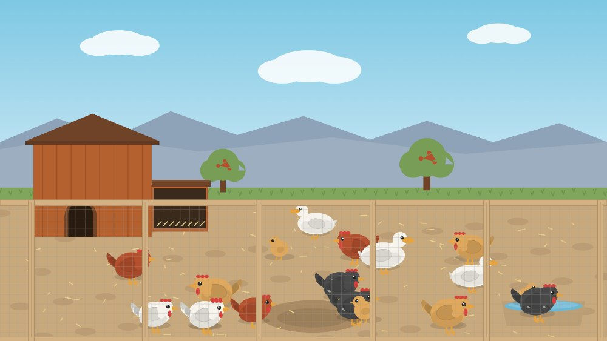

# Chicken Yard

A tap-anywhere toy for toddlers — a backyard chicken run drawn entirely with
Canvas 2D vector paths, with sound synthesized live in the Web Audio API. No
build step, no dependencies, no network requests. Open `index.html` and it runs.

**Live:** https://joshuablotter.github.io/chicken-yard/

## What you can do

- **Tap open ground** — scatter feed; the flock runs over and pecks it up.
- **Drag a finger** — leave a trail of feed the birds chase.
- **Tap a bird** — it flaps and squawks; its neighbors startle and scatter.
- **Tap the nest box lid** — a hen lays an egg. Hens also lay on their own now and then.
- **Tap the water trough** — ripples spread and the ducks come dip their bills.
- **Tap the sky** — a distant flock arcs across the horizon.

No score, no goal, no way to get stuck — just a living yard.

## Install it as an app

It's a PWA, so you can add it to a phone or tablet home screen and it launches
fullscreen (no browser bar) and runs offline.

- **iPhone / iPad (Safari):** open the live link, tap **Share → Add to Home
  Screen**. Launch it from the new icon and hold the device **landscape**.
  (iOS doesn't let web apps lock orientation, so it won't auto-rotate — but the
  scene letterboxes cleanly in portrait too.)
- **Android (Chrome):** open the link, then **⋮ menu → Install app / Add to
  Home screen**. Android honors the landscape hint.

## Tuning

Every tunable number lives in the `CONFIG` object at the top of the script
(bird counts, speeds, feed amounts, volume, palette, lay rate).
