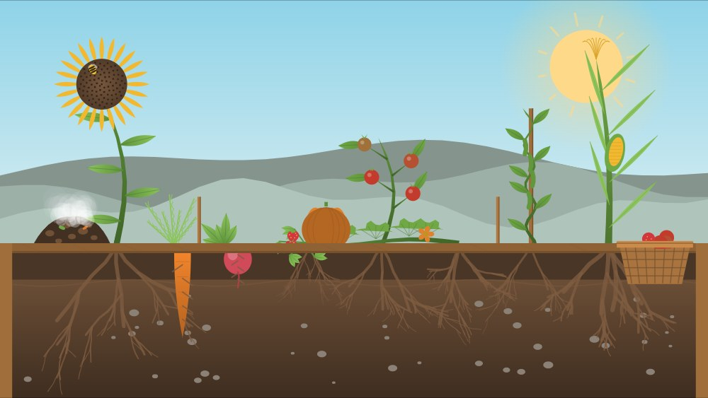

# Barnyard Toys

Tap-anywhere toys for toddlers, drawn entirely with Canvas 2D vector paths and
sound synthesized live in the Web Audio API. No build step, no dependencies, no
network requests. Open `index.html` and pick a toy.

**Live:** https://joshuablotter.github.io/chicken-yard/

Opening the app shows a simple chooser (`index.html`):

- **🐔 Chicken Yard** → [`chicken-yard.html`](chicken-yard.html)
- **🦆 Duck Pond** → [`duck-pond.html`](duck-pond.html)
- **🌱 Grow a Garden** → [`garden.html`](garden.html)

Each toy is a single self-contained file. No score, no goal, no way to get
stuck — just a living scene that rewards every touch.

## Chicken Yard

A backyard chicken run.

- **Tap open ground** — scatter feed; the flock runs over and pecks it up.
- **Drag a finger** — leave a trail of feed the birds chase.
- **Tap a bird** — it flaps and squawks; its neighbors startle and scatter.
- **Tap the nest box lid** — a hen lays an egg. Hens also lay on their own now and then.
- **Tap the water trough** — ripples spread and the ducks come dip their bills.
- **Tap the sky** — a distant flock arcs across the horizon.

## Duck Pond

A small farm pond whose surface is a **real height-field wave simulation** —
ripples spread, overlap, and interfere like actual water, and everything
floating (ducks, ducklings, lily pads, peas, the log) bobs and tilts by reading
the local wave height. A drake, three hens, and five ducklings that trail a hen
in a wobbly line share the water.

- **Tap the water** — a wave spreads out; the two nearest ducks come investigate.
- **Drag a finger** — carve a wake; the ducklings follow the finger.
- **Tap a duck** — it flaps, quacks, and shakes; tap it again as it settles and it dabbles bottom-up.
- **Tap the grassy bank** — a handful of peas drops in and every duck converges to eat.
- **Tap the reeds** — a frog hops out to a lily pad, or a dragonfly lifts off (alternating).
- **Tap a lily pad** — it dips and springs back, throwing a ring of ripples.

## Grow a Garden

A raised garden bed shown side-on, with a **soil cutaway** below the surface —
the best part. Every plant is generated from a seeded recursive branching
function driven by a single growth parameter, so it unfurls organically instead
of scaling up like a sprite, and no two are alike. The same branching runs
downward to draw the roots, so you watch a carrot's taproot swell underground
while its feathery greens grow above. A shared wind field bends the whole bed
together. Nothing ever wilts, dies, or needs saving.

- **Tap the soil** — a seed drops and a plant sprouts, growing over ~5 seconds.
  Repeated taps rotate through eight kinds (sunflower, carrot, radish, tomato,
  corn, pumpkin, bean, strawberry).
- **Drag along the soil** — plant a whole staggered row, each sprouting a beat
  after the last.
- **Tap the sky** — a cloud rolls in and rains; growing plants surge, the soil
  darkens, and a rainbow follows.
- **Tap the sun** — it pulses warm and every plant leans toward it, then eases back.
- **Tap a grown plant** — it bounces on a spring and any ripe fruit pops off into
  the basket at the edge of the bed, then regrows.
- **Tap a flower** — a bee or butterfly wanders in to visit, then moves on.
- **Tap below the soil line** — a worm surfaces, wriggles, and burrows back down.
- **Tap the compost pile** — it puffs and a few volunteer sprouts pop up beside it.

## Install it as an app

It's a PWA, so you can add it to a phone or tablet home screen and it launches
fullscreen (no browser bar) and runs offline once opened once.

- **iPhone / iPad (Safari):** open the live link, tap **Share → Add to Home
  Screen**. Launch it from the new icon and hold the device **landscape**.
  (iOS doesn't let web apps lock orientation, so it won't auto-rotate — but the
  scenes letterbox cleanly in portrait too.)
- **Android (Chrome):** open the link, then **⋮ menu → Install app / Add to
  Home screen**. Android honors the landscape hint.

## Tuning

Every tunable number lives in the `CONFIG` object at the top of each toy's
script (counts, speeds, feed amounts, volume, palette).

For **Duck Pond**, the three values that control the feel of the water are, in
order: `waterDamping` (how long ripples live), `tapImpulse` (how big a tap
splashes), and `wakeStrength` (how strongly a swimming duck's wake pushes the
surface). If the water sim ever chugs on an older tablet, drop `gridW`/`gridH`
from 160×90 to 120×68.

For **Grow a Garden**, the three to reach for first are `growSeconds` (how long
seed→mature takes), `windStrength` (how much the whole bed sways), and
`rainGrowMult` (how sharply rain speeds growth). To add a ninth plant, add an
entry to the `SPECS` table reusing an existing `form`, then list it in
`SPEC_ORDER` — no need to touch the generator.
